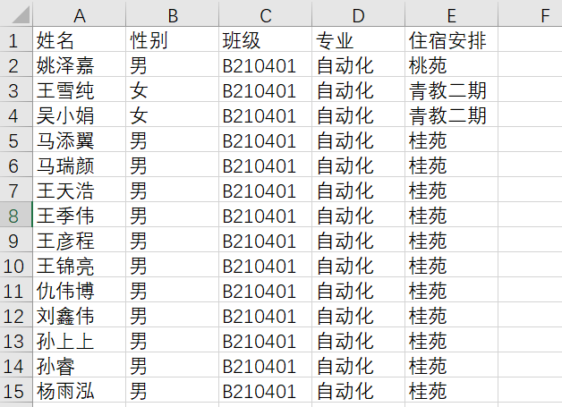
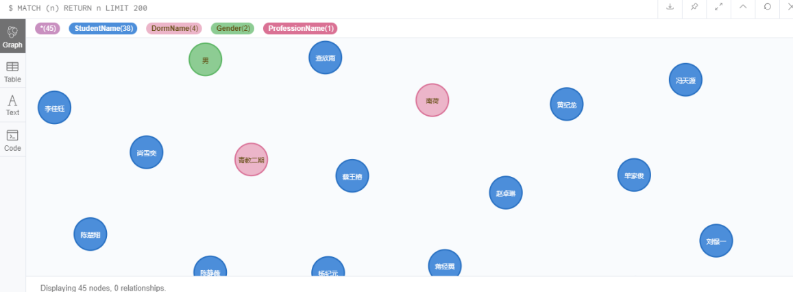
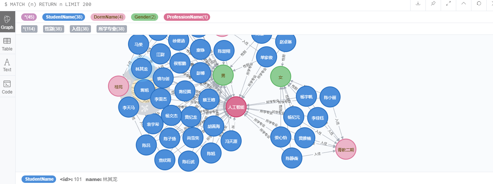
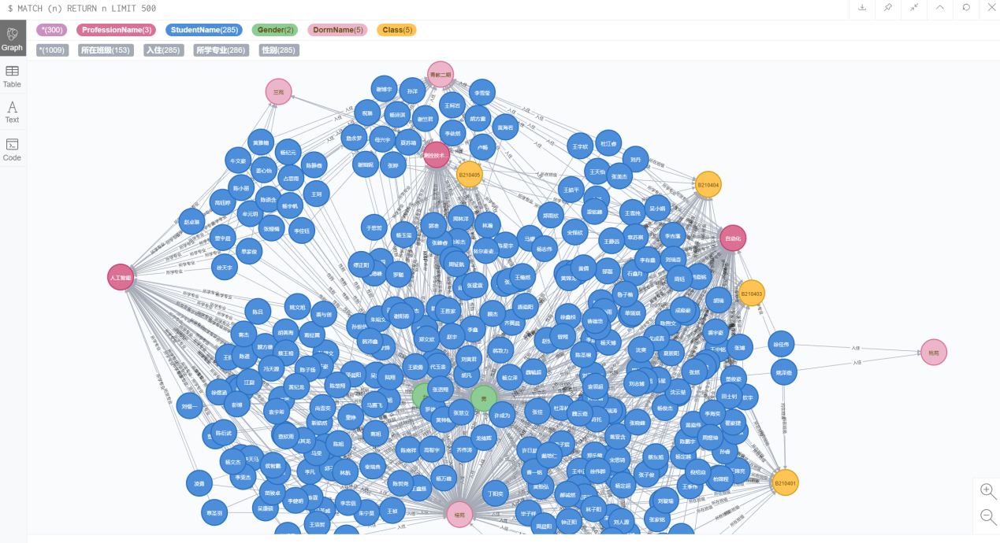
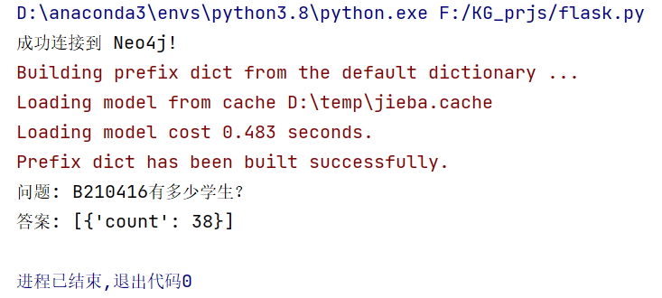

#                     基于Neo4j的21级本院部分专业学生的知识图谱的设计与实现

## 引言

​        在翻译完成了一篇基于Neo4j的Java知识图谱系统的论文之后，由于我不太懂Java的结构和编程，服务器docker部署也属于是一知半解，所以没有能完全复现它的Java体系的知识图谱的设计与部署（T_T），但是，由于我经常帮辅导员处理材料，所以我手上有他所有学生的很多基本信息，因此，我构建了一个关于南京邮电大学21级自动化、测控技术与仪器、人工智能三个专业共九个班286位同学的一个简单的知识图谱。

## 数据预处理

首先是数据的处理，因为原数据里存在着很多杂乱无用的信息，比如学号、手机号码、家庭住址、入学时间等等（由于隐私问题暂不列出），而我只需要姓名、性别、班级、专业、住宿安排即可。此外，因为住宿安排信息较细，所以这里我选择将其只保留到所住苑区。

使用代码如下：

```python
import pandas as pd

# 读取原始Excel文件
file_path = '学生基本信息wp.xlsx'
df = pd.read_excel(file_path)

# 处理住宿安排列，只保留第一个“-”前的字
df['住宿安排'] = df['住宿安排'].apply(lambda x: x.split('-')[0] if isinstance(x, str) else x)

# 保留需要的列
df = df[['姓名', '性别', '班级', '专业', '住宿安排']]

# 保存到一个新的CSV文件
new_file_path = 'students_all_classes.csv'
df.to_csv(new_file_path, index=False, encoding='utf-8-sig')
```

实现效果如下：



如果只是需要某个班，而非整个年级的所有班级整合信息，那么可以使用下面的代码：

```Python
import pandas as pd

# 读取原始Excel文件
file_path = '学生基本信息wp.xlsx'
df = pd.read_excel(file_path)

# 遍历所有班级并保存到不同的CSV文件中
for class_name, group in df.groupby('班级'):
    # 处理住宿安排列，只保留第一个“-”前的字
    group['住宿安排'] = group['住宿安排'].apply(lambda x: x.split('-')[0] if isinstance(x, str) else x)

    # 保留需要的列
    group = group[['姓名', '性别', '班级', '专业', '住宿安排']]

    # 保存到新的CSV文件
    new_file_path = f'students{class_name}.csv'
    group.to_csv(new_file_path, index=False, encoding='utf-8-sig')
```

## 举个栗子

首先以我们班（B210416班）为例，我先构建了一个小型的，仅包含我们班38位同学，包括姓名、所住苑区、性别等关系的知识图谱。

首先，导入csv文件建立所有节点：性别、班级、宿舍苑区

```cypher
LOAD CSV WITH HEADERS FROM 'file:///students16.csv' AS row
// 创建性别节点
MERGE (male:Gender {type: '男'})
MERGE (female:Gender {type: '女'})
// 创建唯一的宿舍名称
WITH row
MERGE (dormName:DormName {name: row.住宿安排})
// 创建唯一的班级名称
WITH row
MERGE (className:Class {name: row.班级})
// 创建学生节点
WITH row
MERGE (student:StudentName {name: row.姓名})
```

实现结果如下：



然后，利用csv文件中的首行的信息对包括姓名、性别、宿舍、班级等实体实现关系的建立。

代码如下：

```cypher
LOAD CSV WITH HEADERS FROM 'file://studentsB210416.csv' AS row
MATCH (student:StudentName {name: row.姓名})
// 关联学生节点和性别节点
WITH row, student
MATCH (gender:Gender {type: row.性别})
MERGE (student)-[:性别]->(gender)
// 关联学生节点和宿舍名称节点
WITH row, student
MATCH (dormName:DormName {name: SPLIT(row.住宿安排, '-')[0]})
MERGE (student)-[:入住]->(dormName)
// 关联学生节点和班级节点
WITH row, student
MATCH (className:Class {name: row.班级})
MERGE (student)-[:所在班级]->(className)
```

结果如下：




## Done

随后，我便利用Python写了一个简单的脚本程序，以根据九个班的班级名称来生成各个班的知识图谱建立的Cypher语言代码：

```python
import os

# 目录路径
directory = 'allclasscsv'  # 请替换为实际路径
# 输出Cypher代码的文件路径
output_file = 'KG_prj_cypher_coding.txt'

# 模板Cypher代码
cypher_template = '''
LOAD CSV WITH HEADERS FROM 'file:///{filename}' AS row
MATCH (student:StudentName {{name: row.姓名}})
// 关联学生节点和性别节点
WITH row, student
MATCH (gender:Gender {{type: row.性别}})
MERGE (student)-[:性别]->(gender)

// 关联学生节点和宿舍名称节点
WITH row, student
MATCH (dormName:DormName {{name: row.住宿安排}})
MERGE (student)-[:入住]->(dormName)

// 关联学生节点和专业名称节点
WITH row, student
MATCH (professionName:ProfessionName {{name: row.专业}})
MERGE (student)-[:所学专业]->(professionName)

// 关联学生节点和班级节点
WITH row, student
MATCH (className:Class {{name: row.班级}})
MERGE (student)-[:所在班级]->(className)
'''

# 获取所有CSV文件名
csv_files = [f for f in os.listdir(directory) if f.endswith('.csv')]

# 生成Cypher代码并写入文件
with open(output_file, 'w', encoding='utf-8') as f:
    for csv_file in csv_files:
        cypher_code = cypher_template.format(filename=csv_file)
        f.write(cypher_code + '\n\n')

print(f"Cypher commands have been written to {output_file}")
```

运行之后便生成了可以建立九个班的知识图谱的代码，将它们输入至Neo4j浏览器，便得到了以下结果：



## 一个简单的KGQA系统（有点鸡肋的）

后面我又构思实现了一个简单的知识图谱智能问答（KGQA）系统，利用Python的jieba，py2neo等库进行分词、向量化和余弦相似度计算，找到与用户输入问题最相似的示例问题，然后根据相应的查询模板在 Neo4j 数据库中执行查询。

首先，连接到 Neo4j 数据库：

```Python
# 尝试连接到 Neo4j 数据库
try:
    graph = Graph("bolt://127.0.0.1:7687", auth=("neo4j", "password"))
    print("成功连接到 Neo4j!")
except Exception as e:
    print("连接到 Neo4j 时出错:", e)
    raise e
```

然后，定义示例问题和查询模板，使用一个列表 qa_pairs存储示例问题和对应的查询模板。（目前只定义了这么多，仅仅为了展示效果，如果需要，可以考虑通过神经网络，调用智谱API用合适的promt产生更多模版(·▽·）+)

```Python
# 示例问题和对应的查询模板
qa_pairs = [
    {"question": "B210416班有多少学生？",
     "template": "MATCH (c:Class {name: 'B210416'})<-[:所在班级]-(s:StudentName) RETURN COUNT(s) AS count"},
    {"question": "男生有多少？", "template": "MATCH (s:StudentName)-[:性别]->(:Gender {type: '男'}) RETURN COUNT(s) AS count"},
    {"question": "哪个学生住在宿舍1？",
     "template": "MATCH (s:StudentName)-[:入住]->(:DormName {name: '宿舍1'}) RETURN s.name AS student_name"},
    # 更多的示例和模板可以在这里添加
]
```

使用 jieba 对示例问题进行分词，使用 TfidfVectorizer 对分词后的示例问题进行向量化。

```python
# 对示例问题进行分词
questions = [qa['question'] for qa in qa_pairs]
segmented_questions = [' '.join(jieba.cut(question)) for question in questions]

# 初始化TF-IDF向量化器
vectorizer = TfidfVectorizer()
vectorized_questions = vectorizer.fit_transform(segmented_questions)
```

然后根据用户输入的问题，找到与之最相似的示例问题，并使用对应的查询模板在 Neo4j 数据库中执行查询。

```python
def get_answer(user_question):
    # 对用户问题进行分词
    segmented_user_question = ' '.join(jieba.cut(user_question))

    # 向量化用户问题
    user_question_vector = vectorizer.transform([segmented_user_question])

    # 计算相似度
    similarities = cosine_similarity(user_question_vector, vectorized_questions)

    # 找到最相似的问题
    best_match_index = similarities.argmax()
    best_match_score = similarities[0, best_match_index]

    if best_match_score > 0.5:  # 设置一个相似度阈值
        best_match_qa = qa_pairs[best_match_index]
        query = best_match_qa['template']
        result = graph.run(query).data()
        return result
    else:
        return "抱歉，我无法理解您的问题。"
```

最后，使用示例用户问题测试问答系统。

```Python
# 测试问答系统
user_question = "B210416有多少学生？"
answer = get_answer(user_question)
print(f"问题: {user_question}")
print(f"答案: {answer}")
```

结果如下：

